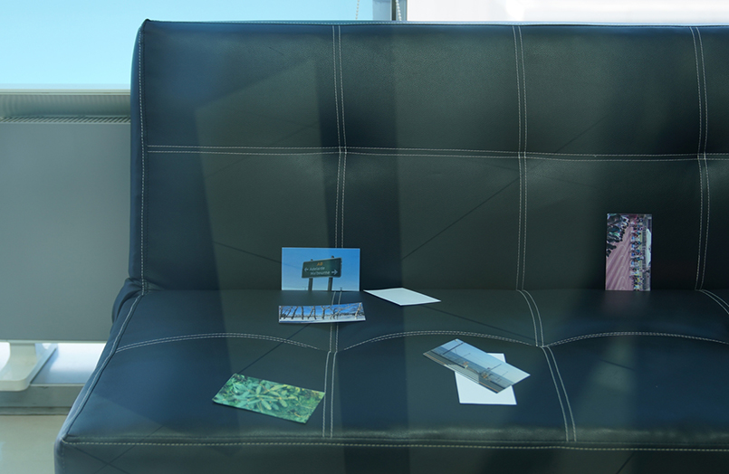
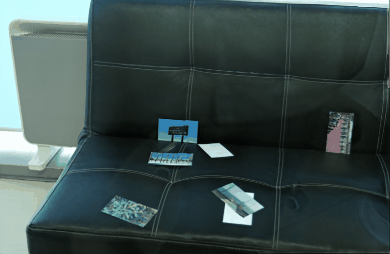
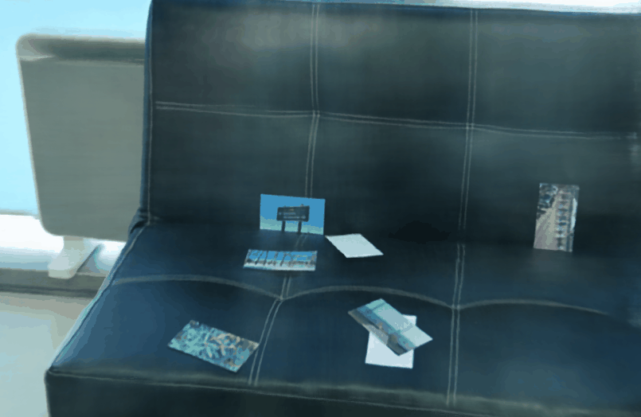

# Transmitted NeRF

This is the implementation of NeurIPS 2022 paper [Neural Transmitted Radiance Fields](https://openreview.net/pdf?id=KglFYlTiASW).

## Demo
|  |    |  |
| ----------------------------- | ---------------- | ----------------- |
|Input example (w/ reflection) | **Ours, 6 training views.** | Ground truth (w/o reflection)|
|  |    |  |
| [NeRF](https://www.matthewtancik.com/nerf), 6 training views. | NeRF, 18 training views.|  [NeRF-W](https://nerf-w.github.io/), 6 training views.|

## Quick Start
<!-- 1. Download the pretrained model of ERRNet at the official repository [link](https://github.com/Vandermode/ERRNet), and move `errnet_060_00463920.pt` to `ckpt_ERRNet/`. -->

<!-- 2. Run the recurring edge estimation by `python preprocessing/`. By default, this command generates a folder `edge/` under the specified dataset folder, containing the estimated recurring edge of each viewpoint. -->

[TODO] Coming soon!

## Dataset
Our data is available at https://drive.google.com/drive/folders/1Gwzz8DgORrd9b_VEdk9z2108qJXz6bfk
